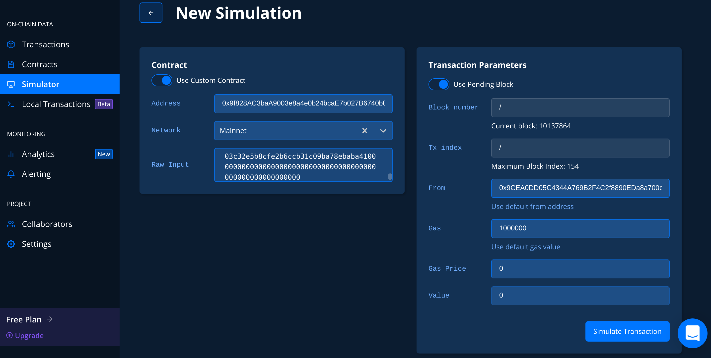
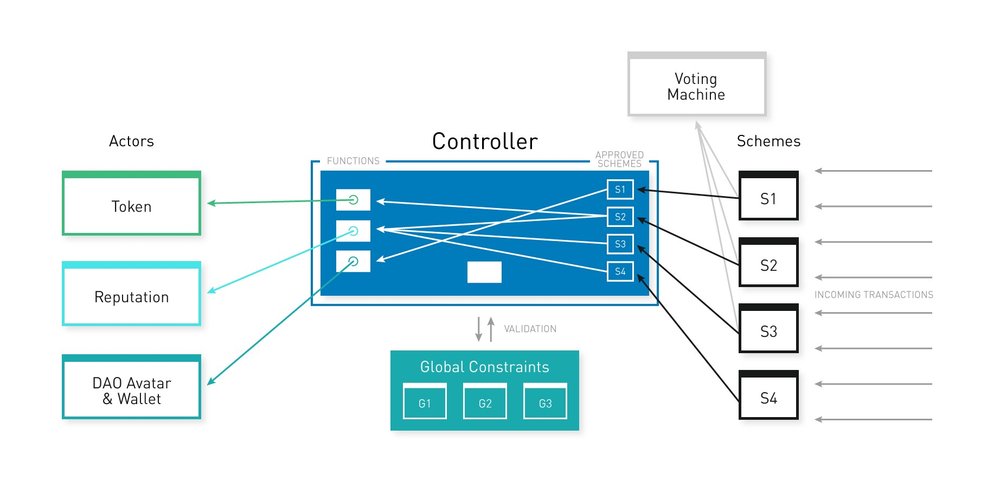

# DXdao Snapshot DB Tool

## Install
```
yarn
```

And configure your .env file with your Infura, Etherscan and Tenderly API keys.
```
KEY_INFURA_API_KEY="xxxx"
KEY_ETHERSCAN="xxxx"
KEY_TENDERLY="xxxx" (optional)
```

## Commands

With `yarn start` it will use the default snapshot provided form the repository, get the transactions and generate the snapshot.
Use `TO_BLOCK` with the maximum block you want to analyze parameter you want to use, using latest provided by the web3 provider by default.

### Get Transactions
```
yarn transactions
```

### Build Snapshopt

```
yarn snapshot
```

## Snapshot Viewer

You can view, navigate and search in the snapshot file by using an online json viewer, https://jsoneditoronline.org/. Just import the `DXdaoSnapshot.json` file from your disk.

## Simulate Transactions

At the end of the snapshot script it will log the proposals that will execute a generic call. This calls can be simulated using a free account in (tenderly)[https://dashboard.tenderly.co/]

For example, for the proposal:
```
Generic proposal 0xe7d3b81c6221a5e39bfeac13d61ae559fd783f62340f1051da2d7d474e32070d in EnsRegistryScheme active to simulate 
 { to: '0x9f828AC3baA9003e8a4e0b24bcaE7b027B6740b0',
  from: '0x9CEA0DD05C4344A769B2F4C2f8890EDa8a700d64',
  data:
   '0xd1b7089a00000000000000000000000000000000000c2e074ec69a0dfb2997ba6c7d2e1e0000000000000000000000000000000000000000000000000000000000000080000000000000000000000000519b70055af55a007110b4ff99b0ea33071c720a000000000000000000000000000000000000000000000000000000000000000000000000000000000000000000000000000000000000000000000000000000441896f70af8fabcf7d9650c93acc010dba6eae53a9732022d237a5bcb5226c62af6755e710000000000000000000000004976fb03c32e5b8cfe2b6ccb31c09ba78ebaba4100000000000000000000000000000000000000000000000000000000',
  value: '0' }
```




## Snapshot Format

```
{
  fromBlock: Number,
  toBlock: Number,
  controller: {
    txs: [ {
      hash: "32 Bytes: String: Hash of the transaction."
      nonce: "Number: The number of transactions made by the sender prior to this one."
      blockHash: " Bytes - String: Hash of the block where this transaction was in. null when its pending."
      blockNumber: "Number: Block number where this transaction was in. null when its pending."
      transactionIndex: "Number: Integer of the transactions index position in the block. null when its pending."
      from: "String: Address of the sender."
      to: "String: Address of the receiver. null when its a contract creation transaction."
      value: "String: Value transferred in wei."
      gasPrice: "String: Gas price provided by the sender in wei."
      gas: "Number: Gas provided by the sender."
      input: "String: The data sent along with the transaction."
      receipt: {
        status: "Boolean: TRUE if the transaction was successful, FALSE, if the EVM reverted the transaction."
        blockHash: "32 Bytes: Hash of the block where this transaction was in."
        blockNumber: "Number: Block number where this transaction was in."
        transactionHash: "32 Bytes: Hash of the transaction."
        transactionIndex: "Number: Integer of the transactions index position in the block."
        from: "String: Address of the sender."
        to: "String: Address of the receiver. null when its a contract creation transaction."
        contractAddress: "String: The contract address created, if the transaction was a contract creation, otherwise null."
        cumulativeGasUsed: "Number: The total amount of gas used when this transaction was executed in the block."
        gasUsed: "Number: The amount of gas used by this specific transaction alone."
        logs: "Array: Array of log objects, which this transaction generated."
      }
    } ... ],
    internalTxs: [ {
      status: "Boolean: TRUE if the transaction was successful, FALSE, if the EVM reverted the transaction."
      blockHash: "32 Bytes: Hash of the block where this transaction was in."
      blockNumber: "Number: Block number where this transaction was in."
      transactionHash: "32 Bytes: Hash of the transaction."
      transactionIndex: "Number: Integer of the transactions index position in the block."
      from: "String: Address of the sender."
      to: "String: Address of the receiver. null when its a contract creation transaction."
      contractAddress: "String: The contract address created, if the transaction was a contract creation, otherwise null."
      cumulativeGasUsed: "Number: The total amount of gas used when this transaction was executed in the block."
      gasUsed: "Number: The amount of gas used by this specific transaction alone."
      logs: "Array: Array of log objects, which this transaction generated."
    } ... ],
    events: [ {
      event: "String: The event name."
      signature: "String|Null: The event signature, null if it’s an anonymous event."
      address: "String: Address this event originated from."
      returnValues: "Object: The return values coming from the event, e.g. {myVar: 1, myVar2: '0x234...'}."
      logIndex: "Number: Integer of the event index position in the block."
      transactionIndex: "Number: Integer of the transaction’s index position the event was created in."
      transactionHash: " Bytes - String: Hash of the transaction this event was created in."
      blockHash: "Bytes - String: Hash of the block this event was created in. null when it’s still pending."
      blockNumber: "Number: The block number this log was created in. null when still pending."
      raw.data: "String: The data containing non-indexed log parameter."
      raw.topics: "Array: An array with max 4 32 Byte topics, topic 1-3 contains indexed parameters of the event."
    } ... ]
  },
  avatar: {
    txs: [ Tx ],
    internalTxs: [ TxReceipt ],
    events: [ Event ]
  },
  reputation: {
    txs: [ Tx ],
    internalTxs: [ TxReceipt ],
    events: [ Event ]
  },
  token: {
    txs: [ Tx ],
    internalTxs: [ TxReceipt ],
    events: [ Event ]
  },
  schemes: {
    scheme1: {
      txs: [ Tx ],
      internalTxs: [ TxReceipt ],
      events: [ Event ]
    },
    ...
    schemeX: {
      txs: [ Tx ],
      internalTxs: [ TxReceipt ],
      events: [ Event ]
    }
  }
}
```


## Main Contracts



Controller: https://etherscan.io/address/0x9f828ac3baa9003e8a4e0b24bcae7b027b6740b0

Avatar: https://etherscan.io/address/0x519b70055af55a007110b4ff99b0ea33071c720a

Reputation: https://etherscan.io/address/0x7a927a93f221976aae26d5d077477307170f0b7c

Token: https://etherscan.io/address/0x643b14f6ea235668278da5974930105852f2b7c4

Genesis Protocol: https://etherscan.io/address/0x332b8c9734b4097de50f302f7d9f273ffdb45b84

## Schemes 

Creator account (Not active): https://etherscan.io/address/0x0a530100affb0a06edd2ed74e335afc50624f345

DxLockMgnForRep: https://etherscan.io/address/0x2E6FaE82c77e1D6433CCaAaF90281523b99D0D0a

DxGenAuction4Rep: https://etherscan.io/address/0x4D8DB062dEFa0254d00a44aA1602C30594e47B12

DxLockEth4Rep: https://etherscan.io/address/0x4564BFe303900178578769b2D76B1a13533E5fd5

DxLockWhitelisted4Rep: https://etherscan.io/address/0x1cb5B2BB4030220ad5417229A7A1E3c373cDD2F6

DutchX (GenericScheme): https://etherscan.io/address/0x199719EE4d5DCF174B80b80afa1FE4a8e5b0E3A0

SchemeRegistrar: https://etherscan.io/address/0xf050F3C6772Ff35eB174A6900833243fcCD0261F

ContributionReward: https://etherscan.io/address/0x08cC7BBa91b849156e9c44DEd51896B38400f55B

GenericSchemeENSPublicProvider: https://etherscan.io/address/0x9A543aeF934c21Da5814785E38f9A7892D3CDE6E

EnsRegistrar (GenericScheme): https://etherscan.io/address/0x973ce4e81BdC3bD39f46038f3AaA928B04558b08

EnsRegistry (GenericScheme): https://etherscan.io/address/0x9CEA0DD05C4344A769B2F4C2f8890EDa8a700d64

TokenRegistry (GenericScheme): https://etherscan.io/address/0xc072171dA83CCe311e37BC1d168f54E6A6536DF4

GenericSchemeENSPublicResolver: https://etherscan.io/address/0xb3ec6089556cca49549be01ff446cf40fa81c84d

GenericSchemeMulticall: https://etherscan.io/address/0xef9dC3c39CA40A2a3000ACc5ca0467CE1C250808
